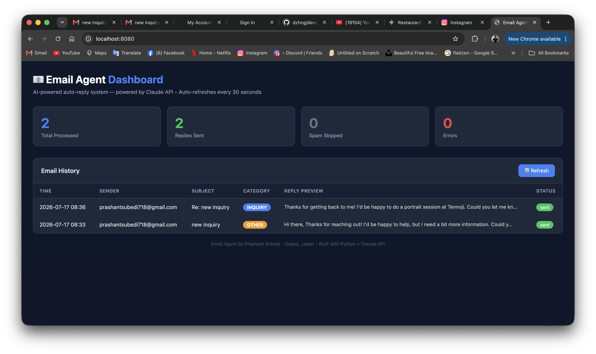

# 📧 AI Email Auto-Reply Agent

A Python-based AI agent that monitors a Gmail inbox, automatically replies to incoming emails using the Anthropic Claude API, stores email history in a SQLite database, and displays everything in a real-time web dashboard.

Built as a portfolio project to demonstrate backend development, AI integration, and database design.

---

## 🖥️ Dashboard Preview

> Dark-themed web dashboard showing real-time email processing stats, category badges, reply previews, and status indicators. Auto-refreshes every 30 seconds.



---

## 🎯 What It Does

1. **Monitors** a Gmail inbox every 60 seconds using IMAP
2. **Reads** each new unread email (sender, subject, body)
3. **Analyzes** the email using Claude AI — classifies it and writes a professional reply
4. **Sends** the reply automatically via Gmail SMTP
5. **Stores** every processed email in a SQLite database
6. **Displays** everything in a real-time web dashboard at `localhost:8080`

---

## 🤖 How the AI Works

Each email is sent to Claude (Anthropic's AI) with a system prompt that defines:
- The persona (freelance photographer based in Osaka, Japan)
- Classification categories: INQUIRY, COMPLAINT, SPAM, PERSONAL, OTHER
- Reply tone and format rules

Claude returns a category and a professionally written reply. The system sends the reply — or skips it if the email is spam.

---

## 🛠️ Tech Stack

| Technology | Purpose |
|---|---|
| Python 3.9+ | Core language |
| Anthropic Claude API (Haiku) | Email classification and reply generation |
| `imaplib` (built-in) | Reading emails from Gmail via IMAP |
| `smtplib` (built-in) | Sending emails via Gmail SMTP |
| `sqlite3` (built-in) | Local database for email history |
| `http.server` (built-in) | Web dashboard server |
| `python-dotenv` | Secure credential management |
| Gmail App Password | Secure Gmail authentication |

**Zero frameworks. Zero paid services. Pure Python.**

---

## 📁 Project Structure
email-agent/
├── main.py            # Main agent loop — runs continuously every 60s
├── dashboard.py       # Web dashboard server — visit localhost:8080
├── test_claude.py     # Phase 1: Tests Claude API connection
├── read_email.py      # Phase 2: Reads emails from Gmail
├── claude_reply.py    # Phase 3: Connects Claude to emails
├── send_email.py      # Phase 4: Sends Claude's replies
├── email_agent.db     # SQLite database (auto-created, not on GitHub)
├── agent.log          # Runtime log (auto-created, not on GitHub)
├── requirements.txt   # Python dependencies
├── .env               # Secret credentials (never on GitHub)
├── .gitignore         # Prevents .env from being committed
└── README.md          # This file

---

## ⚙️ Setup Instructions

### 1. Clone the repository
```bash
git clone https://github.com/Prashantsubedi12/email-agent.git
cd email-agent
```

### 2. Create a virtual environment

**Mac/Linux:**
```bash
python3 -m venv venv
source venv/bin/activate
```

**Windows:**
```bash
python -m venv venv
venv\Scripts\activate
```

### 3. Install dependencies
```bash
pip install anthropic python-dotenv
```

### 4. Configure credentials

Create a `.env` file in the root folder:
ANTHROPIC_API_KEY=your_claude_api_key_here
GMAIL_ADDRESS=your_gmail@gmail.com
GMAIL_APP_PASSWORD=your_16_character_app_password

To get these:
- **Claude API key** → [console.anthropic.com](https://console.anthropic.com)
- **Gmail App Password** → Google Account → Security → 2-Step Verification → App Passwords

### 5. Run the agent
```bash
python3 main.py
```

### 6. Run the dashboard (in a separate terminal)
```bash
python3 dashboard.py
```

Then open your browser and visit:
http://localhost:8080

Press `Ctrl+C` in either terminal to stop.

---

## 🔒 Safety Features

- **Never replies to itself** — skips emails from the same address
- **Never replies twice** — tracks replied IDs in SQLite database
- **Never replies to spam** — Claude classifies and skips automatically
- **Credentials protected** — `.env` excluded from Git via `.gitignore`
- **Error handling** — logs errors and keeps running if something fails
- **Database persistent** — email history survives agent restarts

---

## 🖥️ Dashboard Features

- **Real-time stats** — total processed, replies sent, spam skipped, errors
- **Email history table** — sender, subject, category, reply preview, status
- **Color-coded badges** — INQUIRY (blue), COMPLAINT (red), SPAM (gray), PERSONAL (purple), OTHER (yellow)
- **Auto-refresh** — updates every 30 seconds automatically
- **Clean dark UI** — professional look built with pure HTML/CSS

---

## 📊 Sample Log Output
2026-07-17 17:33:39 [INFO] Email Agent Started
2026-07-17 17:33:39 [INFO] Database ready — email_agent.db
2026-07-17 17:33:39 [INFO] Checking inbox...
2026-07-17 17:33:42 [INFO] Found 1 unread email(s)
2026-07-17 17:33:42 [INFO] Processing: client@example.com — Photography Inquiry
2026-07-17 17:33:45 [INFO] Category: INQUIRY
2026-07-17 17:33:48 [INFO] Reply sent to client@example.com
2026-07-17 17:33:50 [INFO] Sleeping 60 seconds...

---

## 💡 What I Learned

- How to call an external AI API from Python and handle responses
- How IMAP and SMTP protocols work for reading and sending email
- How to write effective system prompts to control AI behavior
- How to design and query a SQLite database from Python
- How to build a lightweight web server using only Python built-ins
- How to manage secrets safely with environment variables
- How to structure a multi-file Python backend project
- How to use Git and GitHub for version control

---

## 🚀 Possible Future Improvements

- Deploy to a cloud server for true 24/7 operation
- Add approve/reject buttons to dashboard before sending replies
- Support HTML email reading (not just plain text)
- Add daily summary email reporting
- Multi-inbox support
- Replace SQLite with PostgreSQL for production scale

---

## 👤 Author

**Prashant Subedi**
IT Student — 産業技術短期大学, Osaka, Japan
Freelance Photographer & Web Developer
GitHub: [@Prashantsubedi12](https://github.com/Prashantsubedi12)
Portfolio: [photography-site-bay-three.vercel.app](https://photography-site-bay-three.vercel.app)

---

## ⚠️ Disclaimer

This project is built for learning and portfolio purposes.
Always test auto-reply systems carefully before using on a real inbox.